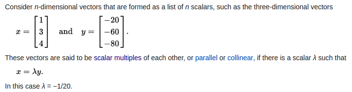
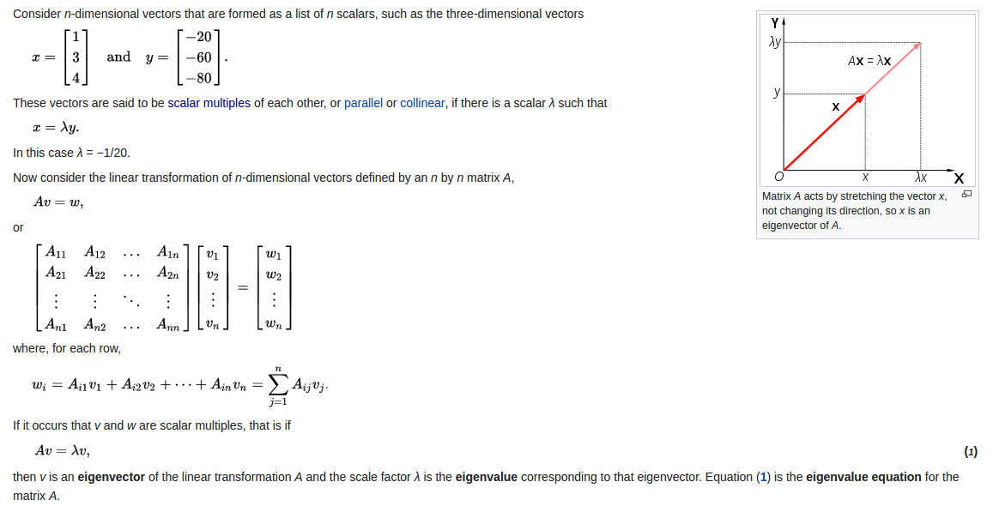
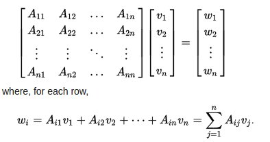
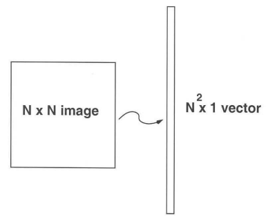
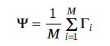
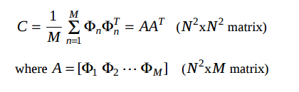
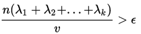
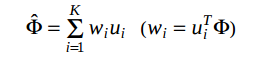

###1. Giới thiệu

Trong tài liệu này sẽ trình bày 2 phương pháp nhận diện khuôn mặt trong opencv là **Eigenfaces** và **Fisherfaces**.

###2. Face Recognition (nhận diện khuôn mặt)

Nhận diện khuôn mặt là 1 hành động vô cùng đơn giản đối với con người. Các thực nghiệm đã cho thấy ngay cả những đứa trẻ
từ 1 tới 3 ngày tuổi đã có thể phân biệt các khuôn mặt mà chúng đã nhìn thấy. Vậy làm thế nào để máy tính có thể thực
hiện được nhận diện khuôn mặt giống như con người? Nhưng hóa ra chúng ra biết rất ít về quá trình nhận diện khuôn mặt từ
trước tới giờ. Có phải các đặc trưng trên khuôn mặt như mắt, mũi, miệng hay các đặc trưng bên ngoài khuôn mặt như hình
dạng đầu, đường chẻ tóc được sử dụng để nhận diện khuôn mặt 1 cách thành công? Làm cách nào để chúng ta phân tích 1 hình
ảnh và làm thế nào để bộ não mã hóa hình ảnh đó? Điều này đã được 2 nhà khoa h **David Hubel** và **Torsten Wiesel** làm rõ, rằng
bộ não của chúng ta có các tế bào thần kinh chuyên biệt phản ứng với các đặc trưng local của 1 cảnh như: đường, cạnh,
góc độ hoặc chuyển động. Do chúng ta không nhìn thế giới theo từng phần rời rạc, vỏ não thị giác của chúng ta bằng cách
nào đó đã kết hợp các nguồn thông tin khác nhau vào thành các khối hữu ích. Nhận diện khuôn mặt tự động là bóc tách các
đặc trưng có nghĩa từ 1 hình ảnh, sau đó đưa chúng vào ... và thực hiện một số loại phân lớp lên các đặc trưng đó.

Nhận diện khuôn mặt dựa trên các đặc trưng hình học của 1 khuôn mặt có lẽ là cách tiếp cận trực quan nhất. Một trong
những hệ thống nhận dạng khuôn mặt tự động đầu tiên đã được trình bày trong tài liệu
[Kanade73](http://docs.opencv.org/2.4/modules/contrib/doc/facerec/facerec_tutorial.html#kanade73):
các điểm đánh dấu (vị trí của mắt, tai, mũi...) được sử dụng để xây dựng các vector đặc trưng (khoảng cách giữa các điểm,
góc giữa chúng...). Quá trình nhận diện được thực hiện bằng cách tính khoảng cách euclide giữa các vector đặc trưng của
1 "probe" và hình ảnh tham chiếu. Do đó, phương pháp này sẽ chống lại được sự thay đổi về hướng chiếu sáng (illumination).
Nhưng nó có 1 nhược điểm rất lớn: việc chọn chính xác các điểm đánh dấu các đặc trưng là khá phức tạp ngay cả với các
thuật toán tiên tiến. Một vector đặc trưng 22 chiều đã được sử dụng trên các tập lớn dữ liệu đã chỉ ra rằng chỉ với
các đặc trưng hình học không đủ thông tin để nhận diện khuôn mặt.

Phương pháp Eigenfaces đã tiếp cập 1 cách toàn diện đối với vấn đề nhận dạng khuôn mặt: 1 khuôn mặt là 1 điểm từ ....
(A facial image is a point from a high-dimensional image space and a lower-dimensional representation is found, where classification becomes easy)
. Ta sử dụng phương pháp Principal Component Analysis (phân tích các thành phần chính) để tìm ra **lower-dimensional subspace**,
phương pháp xác định các **axes** với độ lệch tối đa.

....

###2. Face Database

Đầu tiên, chúng ta cần thiết lập database để thử nghiệm. Do chúng ta đang thực hiện công việc nhận diện khuôn mặt, nên
ta sẽ cần các hình ảnh khuôn mặt. Bạn có thể tạo tập dữ liệu ảnh của riêng bạn hoặc lấy tập face databases sẵn có ở
[đây](http://face-rec.org/databases/). Có 3 cơ sở dữ liệu là:

- **AT&T Facedatabase**: đôi khi còn được gọi là ORL Database of Faces, mỗi đối tượng (1 người) trong tập 40 đối tượng phân biệt
    (distinct subjects) sẽ có 10 ảnh khác nhau. Mỗi ảnh có kích thước 92x112 pixel. Đối với 1 người, các ảnh được lấy ở các
    thời điểm khác nhau, có độ sáng khác nhau, nét mặt khác nhau (mắt mở hay nhắm, cười hay không cười) và các chi tiết
    trên khuôn mặt (đeo kính hay không đeo kính). Tất cả các hình ảnh được chụp trên nền tối đồng nhất, và các khuôn mặt
    trong ảnh đều theo chiều thẳng đứng, bạn có thể xem trước tập ảnh này ở
    [đây](http://www.cl.cam.ac.uk/research/dtg/attarchive/facesataglance.html)

- **Yale Facedatabase A**: còn được gọi là Yalefaces. Tập AT&T Facedatabase chỉ tốt đối với các test ban đầu, vì nó
    là 1 database khá đơn giản **(đơn giản như nào?)**. Phương pháp Eigenfaces đã có tỉ lệ nhận diện đúng là 97% trên tập
    AT&T Facedatabase, do đó ta sẽ không nhìn thấy được bất kì cải tiến lớn nào so với các thuật toán khác. Yalefaces là
    1 tập dữ liệu phù hợp hơn cho các thí nghiệm ban đầu (initial experiments), bởi vì vấn đề nhận dạng là khó khăn hơn.
    Tập Yalefaces bao gồm 15 người (14 nam và 1 nữ), mỗi người có 11 ảnh xám với kích thước 320 x 243 pixel. Các ảnh xám của
    1 người khác nhau về hướng chiếu sáng (ánh sáng chiếu từ trung tâm vào, chiếu từ bên trái và bên phải), nét mặt (vui,
    buồn, bình thường, buồn ngủ, ngạc nhiên, chớp mắt) và kính (có đeo kính / không đeo). Các ảnh gốc chưa được cắt và
    căn lề, bạn có thể tìm hiểu tool [Appendix](http://docs.opencv.org/2.4/modules/contrib/doc/facerec/facerec_tutorial.html#appendixft)
    để thực hiện việc này.

- **Extended Yale Facedatabase B**: chứa 2414 ảnh đã được cắt xén của 38 người khác nhau. Trọng tâm của tập database này
    được đặt trên tập các đặc trưng mạnh liên quan tới hướng chiếu sáng, vì các hình ảnh gần như không thay đổi về cảm xúc.
    Đây là tập dữ liêu khá lớn đối với các thí nghiệm sẽ thực hiện trong tài liệu này.

####2.1 Load ảnh bằng Python

Sau khi đã tải tập dữ liệu AT&T Facedatabase về, chúng ta tiến hành viết 1 hàm Python để đọc các ảnh trong thư
mục dữ liệu AT&T. Hàm trả về các hình ảnh và thư mục tương ứng của ảnh đó. .....

###3. Eigenfaces

####3.1 Eigenvectors

**Eigenvector** (hay characteristic vector) của 1 hàm tuyến tính là 1 vector khác v không, có phương không đổi khi áp dụng
hàm tuyến tính đó lên nó, mà chỉ làm thay đổi độ dài của vector **v** đi **λ** lần nào đó. Cụ thể hơn, nếu **T** là 1
hàm tuyến tính trong không gian vector **V** và **v**
là 1 vector khác vector không trong không gian **V**, thì **v** được coi là 1 eigenvector của hàm tuyến tính **T** nếu
**T(v)** là 1 vector cùng phương (**scalar multiple** - phép nhân vô hướng) với **v**:

    T(v) = λv

Trong đó, λ là 1 giá trị số thực, còn được gọi là **eigenvalue** của eigenvector v.

Ví dụ về eigenvector và eigenvalue của nó trong không gian 3 chiều:

Nếu không gian vector V là hữu hạn (n chiều) thì ta luôn biểu diễn hàm tuyến tính T dưới dạng 1 ma trận vuông **A**
có kích thước n x n, khi đó 1 vector **v** có kích thước n x 1 là 1 eigenvector của ma trận A khi:

    Av = λv

Ta cùng xem ví dụ dưới đây:

Giả sử 1 hàm tuyến tính trong không gian vector n chiều được định nghĩa bởi 1 ma trận vuông A kích thước n x n như sau:

    Av = w

hoặc

Nếu 1 vector **v** trong không gian vector **V** cùng phương với vector **w**, nghĩa là thỏa mãn điều kiện:

    w = λv hay Av = λv

thì **v** là 1 eigenvector của hàm tuyến tính A và **λ** là eigenvalue của eigenvector **v**

####3.2 Eigenfaces

**Eigenfaces** là tên để gọi 1 tập hợp các eigenvectors khi các vector này được sử dụng trong nhận diện khuôn mặt người
trên máy tính. Tập eigenvectors này được rút ra từ **covariance matrix** của sự phân bố xác suất (probability distribution)
trên chiều cao không gian vector (high-dimensional vector space) của các ảnh khuôn mặt. Tập eigenvectors tự nó có thể tạo nên
tập cơ sở cho tất cả các ảnh được dùng để tạo nên **covariance matrix**. Điều này giúp giảm kích thước tập ảnh đầu vào
trong quá trình nhận diện, vì ta có thể áp dụng các giải thuật nhận diện mặt người trên tập cơ sở.

Hướng tiếp cận Eigenface bắt nguồn từ việc tìm kiếm các hình ảnh khuôn mặt có chiều cao thấp (low-dimensional). Ta có thể
sử dụng phương pháp phân tích thành phần chính (principal component analysis  - **PCA**) trên tập các ảnh khuôn mặt để tạo
nên 1 tập các đặc trưng cơ bản (basis features - eigenfaces). Một cách khác, ta có thể coi eigenfaces là 1 tập hợp của các "thành phần
chuẩn của khuôn mặt" (standardized face ingredients), được tạo lên bằng các phân tích thống kê của nhiều hình ảnh khuôn mặt khác nhau.
Các hình ảnh cơ bản (eigenface) sau khi thu được từ tập ảnh khuôn mặt đầu vào - còn được gọi là Eigenpictures - có thể kết hợp
tuyến tính để tạo lại bất kỳ hình ảnh nào trong tập huấn luyện ban đầu. Nếu tập train có **M** ảnh, thì **PCA** có thể tạo
ra 1 tập cơ sở **N** ảnh, với N < M. Ta có thể giảm lỗi khi tái thiết lại tập ảnh ban đầu bằng cách tăng số lượng ảnh trong
eigenpictures, tuy nhiên số lượng được chọn này luôn phải bé hơn M.

Ví dụ, nếu ta muốn tạo ra 1 số N eigenfaces cho tập train có M ảnh, ta có thể nói rằng mỗi hình ảnh khuôn mặt ban đầu có
thể được tạo thành từ 1 **tỉ lệ** của tất cả N đặc trưng hoặc các eigenfaces:

    Face image 1 = (23% of E1) + (2% of E2) + (51% of E3) + ... + (1% En)

Các eigenfaces được tạo ra là các ảnh có các vùng sáng tối được sắp xếp theo 1 mô hình cụ thể (specific pattern). Mô hình
này thể hiện làm thế nào để các đặc trưng khác nhau của 1 khuôn mặt được lựa chọn để đánh giá và tính điểm. Sẽ có 1 mô 
hình khác để đánh giá sự đối xứng trên khuôn mặt, ví dụ như nếu trong ảnh có kiểu tóc lộ ra đường kẻ tóc, hoặc để đánh giá
kích thước của mũi hoặc miệng. 

Các bước để tạo nên 1 tập các eigenvectors và nhận diện 1 ảnh đầu vào:

Bước 1: chuẩn bị 1 tập **M** ảnh để train, yêu cầu các ảnh có kích thước bằng nhau, và nên là các ảnh có cùng điều kiện sáng, có
mắt và miệng giống nhau trên tất cả các ảnh. Mỗi ảnh sẽ được coi là 1 vector bằng cách nối các cột pixel của ảnh ban đầu
thành 1 cột duy nhất. Ví dụ nếu tập ảnh ban đầu có kích thước như nhau là N x N thì mỗi vector của ảnh sẽ là 1 vector cột
có N^2 phần tử, ảnh thứ **i** sẽ có vector tương ứng là **Ti**:

Bước 2: Tìm ra vector ảnh trung bình **Ψ** bằng cách lấy giá trị trung bình của các vector ảnh trên toàn bộ tập train **M** ảnh:

Bước 3: Tiến hành **subtract the mean face**, nghĩa là lấy giá trị vector của mỗi hình ảnh ban đầu
trừ đi giá trị vectror trung bình **Ψ** vừa tính được.

    Φi = Ti - Ψ

Bước 4: Tìm ra các eigenvectors và eigenvalues tương ứng của **convariance matrix C**. Mỗi eigenvector sẽ có cùng số chiều
(số thành phần) với vector của hình ảnh ban đầu. Do đó ta có thể coi mỗi eigenvector như là 1 hình ảnh. Vì vậy các eigenvectors
của **convariance matrix** này được gọi là eigenfaces. Các eigenvectors chính là các hướng mà các hình ảnh khác với 
hình ảnh trung bình. 

Ta tính ma trận hiệp phương sai C thông qua ma trận A. Ma trận A là ma trận có các cột là các vector **Φ** của các ảnh
mà ta đã tính ở bước 3, do đó A có kích thước là N^2 x M. Ma trận C bằng tích của ma trận A và ma trận nghịch đảo của nó, 
nên ma trận hiệp phương sai C có kích thước là N^2 x N^2

Bước 4: Tính các eigenvalue **λ**i tương ứng với các eigenvector **v**i của ma trận hiệp phương sai C. Do ma trận C có kích 
thước rất lớn, nên tính trực tiếp là phương pháp không thực tế.

Bước 5: Chọn số lượng các thành phần chính (principal components). Ta tiến hành sắp xếp các eigenvalues theo thứ tự giảm
dần và sắp xếp các eigenvector tương ứng theo thứ tự đó (λ1 > λ2 > .. > λn). Số lượng các thành phần chính **k** được xác định thông qua
1 ngưỡng ε (ngường này người dùng có thể tự định nghĩa - mặc định là: **TODO**)và trên tổng phương sai **v** của S. 
**v** được tính bằng công thức;
   
    v = n(λ1 + λ2 + .. + λn) với n là số lượng eigenvectors
    
Bước 6: **k** được các định là số nhỏ nhất thỏa mãn điều kiện:

Bước 7: Các eigenfaces bây giờ có thể dùng để biểu diễn cả các khuôn mặt đã tồn tại và các mặt mới: ta có thể chiếu 1 ảnh
mới (đã thực hiện mean subtracted nghĩa là đã trừ đi vector trung bình) trên tập các eigenfaces và ghi lại sự khác nhau
giữa ảnh mặt mới đó với ảnh trung bình **Ψ**. Mỗi eigenvalue của 1 eigenvector thể hiện số lượng hình ảnh trong tập train thay đổi
từ hình ảnh trung bình **Ψ** theo hướng của eigenvector đó. 

Nhưng việc chiếu hình ảnh lên tập con **k** phần tử eigenvector
dẫn đến việc mất mát thông tin, do đó ta mới cần sắp xếp số các eigenvector theo thứ tự giảm dần eigenvalue của nó để 
tối thiểu việc mất mát thông tin. Ví dụ, nếu ảnh đầu vào của ta có kích thước 100x100, thì ta sẽ tạo ra được 

Điều này
nảy sinh vấn đề là chiều cao của 1 khuôn mặt. Với 1 ảnh xám có kích thước p x q pixel sẽ tạo ra 1 vector với số chiều là
m = pq.

**Quá trình test**:

Đầu vào là 1 ảnh bất kì, nhưng phải có kích thước trùng với các ảnh trong tập train. Ảnh test sẽ được biểu diễn lại dưới
dạng 1 vector **T**, sau đó sẽ đi qua lần lượt các bước sau:

Bước 1: Chuẩn hóa bằng cách trừ đi vector trung bình **Ψ** đã tìm được trong giai đoạn train:
 
    Φ = T − Ψ
    
Bước 2: Biểu diễn lại vector sau khi đã chuẩn hóa bằng các eigenvectors (eigenfaces):

Bước 3: 

###Tài liệu tham khảo

1. [M. Turk, A. Pentland, "Eigenfaces for Recognition", Journal of Cognitive Neuroscience, 3(1), pp. 71-86, 1991.](http://www.serc.iisc.ernet.in/~venky/SE263/slides/EigenFaces.pdf)

2. [Face Recognition with Python](http://www.bytefish.de/pdf/facerec_python.pdf)

3. [Eigenfaces for Face Detection/Recognition](http://www.vision.jhu.edu/teaching/vision08/Handouts/case_study_pca1.pdf)

