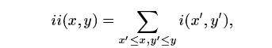
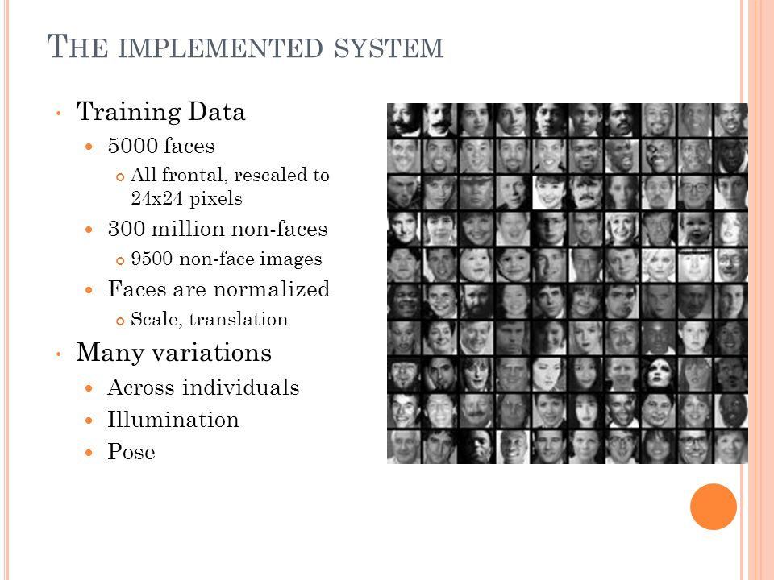
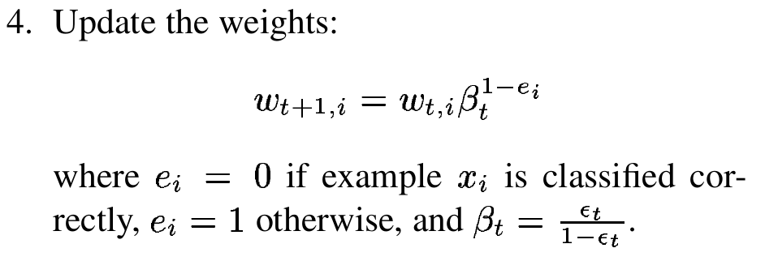

# Rapid Object Detection using a Boosted Cascade of Simple Features

## Phần 1. Giới thiệu

Bài báo **Rapid Object Detection using a Boosted Cascade of Simple Features** trình bày về Viola–Jones object detection framework, một framework sử dụng để xây dựng hệ thống phát hiện đối tượng trong ảnh theo thời gian thực (real-time).

Các vấn đề chính trong bài báo:

1. Trích chọn đặc trưng của ảnh sử dụng **Haar Feature Selection** (có sửa đổi thuật toán filter)
1. Lựa chọn tập các đặc trưng quan trọng của ảnh bằng cách sử dụng AdaBoost.
1. Kết hợp các phương pháp phân lớp (classifiers) được cấu trúc theo mô hình phân tầng (cascade structure) để phát hiện vùng trong ảnh có mặt người.

## Phần 2. Trích chọn đặc trưng  của ảnh

Chúng ta biểu diễn một đối tượng ảnh dưới dạng tập các đặc trưng (features) thay vì biểu diễn ảnh dưới dạng một mảng các pixel trong hệ thống phát hiện đối tượng, vì cách biểu diễn ảnh dưới dạng tập các đặc trưng cho hiệu năng cao hơn.

Đặc trưng của ảnh được sử dụng trong hệ thống này là 3 loại đặc trưng Haar:

- Đặc trưng **two-rectangle feature**
- Đặc trưng **three-rectangle feature**
- Đặc trưng **four-rectangle feature**

Một số thể hiện cụ thể của 3 đặc trưng trên trong OpenCV:

Một ảnh cho trước có thể có nhiều đối tượng đặc trưng. Một đối tượng đặc trưng có các thuộc tính sau:

- Loại đặc trưng (two/three hay four-rectangle feature)
- Các tọa độ đỉnh của đối tượng đặc trưng.
- Kích thước của đối tượng đặc trưng.
- Giá trị của đối tượng đặc trưng ( được tính bằng tổng giá trị sáng của các pixel thuộc các vùng trắng trừ đi tổng giá trị sáng của các pixel thuộc vùng đen).

Ví dụ, xét một đối tượng đặc trưng **two-rectangle feature** **x**:

Các thuộc tính của đối tượng đặc trưng **x** trong ví dụ này là:

- Loại đặc trưng: **two-rectangle feature**
- Tọa độ đỉnh:
  - Điểm đầu: [2,1]
  - Điểm cuối: [3,2]
- Kích thước: 2x2
- Giá trị: value = (6+3) - (5+1) = 3

Với 3 loại đặc trưng trên, một bức ảnh 24x24 có thể có tới trên 180 000 đối tượng đặc trưng cho 3 loại đặc trưng. Với con số đối tượng đặc trưng lớn như vậy, việc tính giá trị của đối tượng đặc trưng theo phương pháp thông thường tốn một khối lượng tính toán lớn: Với một đối tượng **two-rectangle feature** có kích thước 8x8 chúng ta sẽ mất khoảng 31+31 phép cộng và 1 phép trừ, tổng cộng 63 phép toán.

Để giảm thiểu khối lượng tính toán cần thiết để tính ra giá trị của các đối tượng đặc trưng, chúng ta sử dụng phương pháp **Integral Image**

### 2.1. Integral Image

Theo phương pháp phương pháp Integral Image, giá trị tích phân của một điểm có tọa độ (x,y) trong ảnh là:

Theo công thức trên, giá trị tích phân của một điểm có tọa độ (x,y) trên ảnh là tổng giá trị trên các pixel nằm trên phía bên trái của tọa độ x, y, bao gồm cả giá trị của chính pixel nằm ở tọa độ (x,y).

Có được tổng tích phân ở tất cả các tọa độ trong ảnh, chúng ta có thể tính ra tổng giá trị của các pixel trong một hình chữ nhật có kích thước bất kỳ trong ảnh chỉ bằng 4 phép cộng. Ví dụ:

Sau khi có được giá trị tích phân của các điểm 1,2,3,4, chúng ta có thể tính được  giá trị nằm trong các pixel nằm trong diện tích của hình chữ nhật D là sum\_D = 4+1 -(2+3).

Khi đã tính được tổng giá trị của các pixel nằm trong 1 hình chữ nhật, chúng ta có thể nhanh chóng tính được giá trị của đối tượng đặc trưng, vì giá trị này thực chất là sự kết hợp của tổng/hiệu của 2/3/4 hình chữ nhật với nhau. Ví dụ như với đặc trưng **two-rectangle feature**, gía trị của đối tượng đặc trưng bằng (tổng giá trị của các pixel nằm trong 1 hình chữ nhật **trắng** - tổng giá trị của các pixel nằm trong 1 hình chữ nhật **đen**).

Như vậy để tính ra giá trị đặc trưng của một đối tượng đặc trưng có kích thước_ **x**_ bất kỳ, thay vì như phương pháp cũ, _mất O(x^2)_ phép toán, với phương pháp tính tích phân tại các tọa độ chúng ta chỉ luôn luôn mất_ 1|2|3 * 4_ phép toán.

Sau khi tìm ra các đối tượng đặc trưng cũng như giá trị của các đối tượng đặc trưng này  của ảnh, việc tiếp theo chúng ta cần làm là đưa các giá trị đặc trưng này vào mô hình học máy.

## 3. Học các hàm phân lớp bằng AdaBoost (Classification Functions)

Trước khi chúng ta tìm hiểu về cách mà Viola-Jones framework học các hàm phân lớp, chúng ta cùng nhìn lại về con số 24 x 24px. Ở đây chúng ta có thể thấy, cửa sổ nhận dạng có kích thước là 24x24 px, tại sao lại là con số này ?

Con số này liên quan tới bản chất của bài toán nhận dạng khuôn mặt - face detection mà chúng ta đang giải quyết:

Cho một hình ảnh đầu vào x có kích thước a x b pixeal (ví dụ 600x600 px), chúng ta sẽ lấy ra lần lượt các ô ảnh có kích thước c1 x c2 pixel và dự đóan xem ô ảnh được lấy ra có chứa mặt người hay không ?.

Như vậy, bản chất của bài toán chính là cắt từ hình ảnh ra các ô ảnh c1 x c2 pixel (ở đây c1 x c2 pixel chính là 24 x 24 pixel ) , xét một ô ảnh từ tập các ô ảnh lấy ra được, chúng ta cần phân loại ô ảnh đó vào 1 trong 2 lớp sau:

- Lớp d1: Lớp các ô ảnh chứa mặt người.
- Lớp d2: Lớp các ô ảnh không có mặt người.

Như vậy, đây chính là bài toán phân lớp có 2 lớp cho các vùng ảnh 24 x 24 pixel. Và các đặc trưng mà chúng ta đã tính toán được ở phần trên chính là các tham số cho bài toán phân lớp này. Mỗi vùng ảnh 24 x 24 pixel sẽ được lấy ra tập các đặc trưng rồi dùng tập đặc trưng thu được sẽ được đưa vào làm tham số đầu vào cho hàm phân lớp để hàm phân lớp quyết định xem vùng ảnh đó có chứa mặt người hay không.

Chúng ta có thể thấy tập học cho bài toán phân lớp này chính là tập các ảnh 24x24 pixel chứa mặt người và không chứa mặt người.

Vậy quá trình học của bài toán phân lớp này được thực hiện như thế nào ?

Khi chúng ta đã có một tập các đối tượng đặc trưng và một tập training bao gồm 1 tập các ảnh có khuôn mặt và một tập các ảnh không có khuôn mặt, bằng nhiều phương pháp phân lớp chúng ta có thể học ra được hàm phân lớp. Trong hệ thống trình bày trong bài báo này, phương pháp học học được sử dụng là một biến thể của **AdaBoost**. **AdaBoost** không chỉ được sử dụng để học hàm phân lớp, mà phương pháp học này còn được sử dụng để loại bỏ các đối tượng đặc trưng không cần thiết cho việc phân lớp, vì phương pháp này sẽ chỉ lựa chọn ra một tập nhỏ các đặc trưng trong số các đặc trưng của ảnh để tiến hành quá trình học cũng như quá trình phân lớp.

Chúng ta sẽ xem Boosting - AdaBoost là phương pháp gì:

Boosting là phương pháp kết hợp một số hàm phân lớp yếu "weak classifiers: với nhau thông qua các hệ số thành một hàm phân lớp mạnh. Chúng ta có thể thấy, phương pháp boosting xây dựng hàm phân lớp mạnh tuần tự theo vòng lặp: Sau mỗi một vòng lặp, một hàm phân lớp yếu được thêm vào công thức của hàm phân lớp mạnh.

Trong viola-jones framework, việc xây dựng phương pháp Adaboost bắt đầu với việc xây dựng các hàm phân lớp yếu (weak learning algorithm). Các hàm phân lớp yếu này cho phép chọn ra các đối tượng đặc trưng có khả năng phân loại các ảnh có khuôn mặt và ảnh không có khuôn mặt tốt nhất. Với từng đối tượng đặc trưng,thuật toán **weak learning algorithm** sẽ xác định ngưỡng tối ưu của hàm phân loại đối với đặc trưng này, tức là số lượng nhỏ nhất các ví dụ bị phân lớp sai. Một hàm phân lớp yếu **h\_j(x)** bao gồm một đặc trưng **f\_j**, một ngưỡng teta\_j và một tham số p\_j cho biết  hướng của dấu của bất đẳng thức trong phương trình sau:

Với x là một vùng ảnh 24 x 24 pixel mà chúng ta cần phân lớp.

Quá trình xây dựng hàm phân lớp mạnh bằng phương pháp AdaBoost - Boosting được tổng hợp trong hình vẽ sau:

Chúng ta cần lưu ý rằng, trong thực tế thì không có một đặc trưng nào có thể thực hiện việc phân lớp mà không gây ra lỗi phân lớp. Các đặc trưng được lựa chọn trong các vòng đầu của giải thuật thường có lỗi phân lớp từ 0.1 tới 0.3. Trong các vòng tiếp theo, các đặc trưng sẽ khó lựa chọn hơn, và tỉ lệ lỗi phân lớp sẽ lên 0.4 tới 0.5

Tóm tắt quá trình xây dựng hàm phân lớp:

- Đầu vào: Một tập các ví dụ học có n ảnh (x\_1, y\_1) ... (x\_n, y\_n) với y\_i nhận một trong 2 giá trị 0,1  tương ứng với 2 lớp: ảnh không có mặt người (0) và ảnh có mặt người (1).

- Chúng ta khởi tạo trọng số cho từng ví dụ học _i_: w\_1,i = 1/2m, 1/2l với m và l lần lượt là số lượng ảnh không có mặt người (0) và số lượng ảnh có mặt người (1) trong tập ví dụ học.

- Sau khi khởi tạo trọng số ban đầu cho từng ví dụ học, vòng lặp trong phương pháp AdaBoost bắt đầu. Vòng lặp này chạy **T** lần (for t = 1, ..., T), mỗi một lần thực hiện vòng lặp, các hành động sau được thực hiện:

    - Chuẩn hóa trọng số của từng ví dụ học về khoảng [0, 1]:
    - 
    - Với từng đặc trưng **j**, chúng ta huấn luyện hàm phân lớp **h\_j** sao cho **h\_j** chỉ sử dụng duy nhất đặc trung **j** để phân lớp. Lỗi của hàm phân lớp **h\_j** phụ thuộc vào w\_t, được gọi là **epsilon\_j** (). Công thức tính epsilon\_j như sau:
    - 
    - Chúng ta cần lưu ý rằng, mỗi hàm phân lớp yếu mà chúng ta chọn ra sau mỗi vòng lặp chỉ làm việc với một đặc trưng:
    - 
    - Sau khi tính toán được các giá trị lỗi của các hàm phân lớp  **h\_j**, ta sẽ chọn hàm phân lớp **h\_t** có giá trị lỗi  **epsilon\_j** nhỏ nhất trong tập các hàm phân lớp **h\_j**.
    - Sau khi chọn được hàm phân lớp **h\_t**, chúng ta cập nhật trọng số trong vòng lặp tiếp theo cho từng ví dụ học theo giá trị lỗi của hàm phân lớp vừa chọn được:
    - 
- Cuối cùng, sau **T** vòng lặp, chúng ta chọn ra được **T** hàm phân lớp yếu để tổng hợp lại thành hàm phân lớp mạnh mà chúng ta cần xây dựng:

Như chúng ta có thể thấy, mỗi vòng của Adaboots sẽ chọn ra một đặc trưng tương ứng với hàm phân lớp có giá trị lỗi nhỏ nhất từ 180 000 đặc trưng của ảnh 24 x 24. Chính vì lý do này, nên chúng ta mới cần các ví dụ ảnh có kích thước giống nhau (24x24 pixel). Chúng ta cần nhớ rằng, một đặc trưng trong số 180 000 đặc trưng có các thuộc tính sau:

- Loại đặc trưng (two/three hay four-rectangle feature)
- Các tọa độ đỉnh của đối tượng đặc trưng.
- Kích thước của đối tượng đặc trưng.
- Giá trị của đối tượng đặc trưng ( được tính bằng tổng giá trị sáng của các pixel thuộc các vùng trắng trừ đi tổng giá trị sáng của các pixel thuộc vùng đen).

> Table 1: The AdaBoost algorithm for classifier learn-ing. Each round of boosting selects one feature from the 180,000 potential features.

Chúng ta có thể thấy rằng, sau khi áp dụng phương pháp AdaBoost, số lượng đặc trưng mà chúng ta cần sử dụng chỉ là T đặc trưng ( rất nhỏ so với con số 180 000 đặc trưng).

Kết quả thực nghiệm đã cho ra kết quả phân lớp đúng 95 % với hàm phân lớp sử dụng T = 200 đặc trưng, mất 0,7 giây để quét và phân lớp cho một ảnh kích thước 384 x 288 pixel. Tuy nhiên, cách duy nhất để tăng tính chính xác của hàm phân lớp là tăng thêm số đặc trưng - số hàm phân lớp yếu T, đồng nghĩa với việc mức độ phức tạp của thao tác nhận dạng sẽ tăng.

## 4. The Attentional Cascade - Phân lớp theo tầng

Khi sử dụng kiến trúc phân lớp thông thường, với một ảnh có N phân vùng, chúng ta phải thực hiện N lần phân lớp. Việc làm này có độ phức tạp tính toán cao, vì hàm phân lớp AdaBoots có độ phức tạp tính toán lớn. Để cải tốc độ phân lớp cũng như tăng độ chính xác cho giải thuật, kỹ thuật phân lớp theo tầng **Cascading classifiers** đã được sử dụng. Với kỹ thuật cascading classifiers, chúng ta sẽ chia quá trình phân lớp ra thành nhiều giai đoạn, mỗi một giai đoạn chúng ta sẽ sử dụng một hàm phân lớp để loại bỏ dần các phân vùng thuộc lớp 0 (lớp bao gồm các phân vùng không có mặt người) khỏi tập các phân vùng có khả năng chứa mặt người. Ở các giai đoạn đầu các hàm phân lớp đơn giản được sử dụng, vì tuy các hàm này có độ chính xác thấp, nhưng lại có tốc độ rất cao, do đó các hàm này cho phép nhanh chóng loại bỏ một số lượng lớn các phân vùng 24 x 24 không chứa gương mặt khỏi tập các phân vùng tiềm năng. Sau đó, ở các giai đoạn cuối, các hàm phân lớp phức tạp sẽ được sử dụng để tăng độ chính xác cho giải thuật phân lớp, cho đến khi chúng ta tìm ra được các phân vùng chứa mặt người thực sự.

Lúc này, quá trình phát hiện mặt người sẽ được sắp xép giống như một cây quyết định mà mỗi một nút trên cây nằm trên một tầng - "cascade":

Ban đầu, chúng ta có một tập các vùng ảnh cắt ra từ ảnh gốc lớn. Khi đi qua tầng đầu tiên, tập các vùng ảnh bị phân vào lớp O bị loại bỏ, tập các vùng ảnh được phân vào lớp 1 (positive result) là đầu vào của tầng 2. Hàm phân lớp ở tầng 2 sẽ được điều chỉnh để cho kết quả phân lớp có ít lỗi hơn hàm phân lớp ở tầng 1. Tương tự như tầng 1, tập các vùng ảnh được tầng 2 phân vào lớp 1 (positive result) sẽ là đầu vào cho tầng 3, cứ thế tiếp diễn cho đến khi chúng ta tìm ra được các phân vùng chứa mặt người.

Các hàm phân lớp ở các tầng trong kỹ thuật cascading classifiers được xây dựng bằng AdaBoots và được huấn luyện để điều chỉnh ngưỡng phân lớp (threshold) sao cho tối thiểu hóa lỗi phân lớp  vào lớp 0, tức là các hàm phan lớp sẽ phải đảm bảo rằng một phân vùng chứa mặt người thật sẽ có tỉ lệ rất thấp bị các hàm phân lớp phân vào lớp 0. Đây là sự khác biệt giữa threshold sử dụng trong cascading classifiers với threshold mặc định của AdaBoost, vì threshold mặc định của AdaBoost tối thiểu hóa lỗi phân lớp trong tập huấn luyện. Một cách khái quá khi chúng ta đặt ngưỡng phân lớp ở giá trị thấp sẽ làm tăng tỉ lệ phát hiện đúng, cũng như tỉ lệ lỗi phân lớp vào lớp 1 (tức là sẽ có nhiều vùng ảnh không chứa mặt người được phân vào lớp 1).

Ví dụ, ở tầng một chúng ta có thể sử dụng 2 hàm phân lớp mạnh, cùng với điều chỉnh giảm threshold để tối thiểu hóa lỗi phân lớp vào lớp 0. Lúc này khi tính toán với tập trainning đã được xác thực, tầng 1 giữ lại được 100% các phân vùng chứa mặt người, với lỗi phân lớp vào lớp 1 là 40%.

Như vậy, mục tiêu của kỹ thuật cascading classifiers là loại bỏ được nhiều nhất số lượng phân vùng không chứa mặt người sau khi quá trình đi qua các tầng đầu. Vì vậy, các hàm phân lớp phía sau sẽ phải làm nhiệm vụ khó hơn các hàm phân lớp ở các tàng đầu tiên. Việc các tầng phía sau phải làm nhiệm vụ phân biệt khó hơn khiến cho số lượng lỗi phân lớp vào lớp 1 ở các tầng phía sau sẽ tăng cao, tức là sẽ có ít các phân vùng bị xếp vào lớp 0 khi đi qua các tầng phía sau.

### 4.1. Training a Cascade of Classifiers

Quá trình huấn luyện cascading classifiers dẫn tới 2 vấn đề sau: Khi chúng ta sử dụng các hàm phân lớn có nhiều đặc trưng thì tỉ lệ phát hiện đúng sẽ tăng cũng như lỗi phân lớp vào lớp 1 sẽ giảm. Tuy nhiên, khối lượng tính toán cần thực hiện lúc này sẽ tăng lên. Do vậy, một cascading classifiers được định nghĩa là tối ưu khi nó tối ưu được các tham số sau:

1. Số lương tầng (classifier stages) cần sử dụng
1. Số lượng đặc trưng cần sử dụng ở từng tầng
1. Giá trị ngưỡng phân lớp  threshol ở từng tầng

Quá trình huấn luyện sẽ diễn ra như sau:

Từng tầng sẽ được huấn luyện bằng cách tăng thêm số lượng đặc trưng cho tầng đó cho đén khi khả năng phát hiện và lỗi phân lớp vào lớp 1 đạt yêu cầu. Các tầng sẽ được dần dần thêm vào cây quyết định cho khi mục tiêu tổng thể của hệ thống về tỷ lệ phát hiện và lỗi phân lớp vào lớp 1 đạt yêu cầu

## Tài liệu tham khảo

1. [https://en.wikipedia.org/wiki/Viola%E2%80%93Jones_object_detection_framework](https://en.wikipedia.org/wiki/Viola%E2%80%93Jones_object_detection_framework)
1. [http://users.utcluj.ro/~tmarita/HCI/C7-8-extra/Face-detect/violaJones_CVPR2001.pdf](http://users.utcluj.ro/~tmarita/HCI/C7-8-extra/Face-detect/violaJones_CVPR2001.pdf)
1. Rapid Object Detection using a Boosted Cascade of Simple Features
